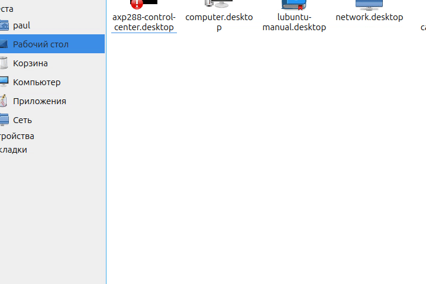
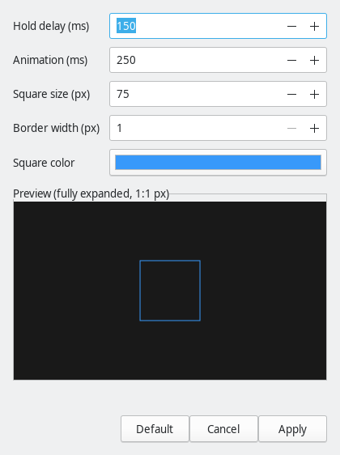

# TouchRMB

`TouchRMB` adds Windows-like right click by long tap on a touchscreen in `X11` desktop sessions.

It is an independent implementation inspired by the long-tap right-click UX found on Windows tablets. No Microsoft code or assets are included.

## Preview

Long-tap animation:



Settings window:



It installs:

- `touchrmb` - low-overhead resident daemon in C
- `touchrmb-settings` - GUI for delay, animation, size, border width, and color

## Requirements

- Linux
- X11 session
- X11 desktop session such as `LXQt` or `XFCE`
- `systemd --user`
- build tools and headers for: `x11`, `xext`, `xtst`, `xi`, `xrandr`, `gtk+-3.0`

## Install

Copy and paste this:

```sh
git clone https://github.com/BlackF1re/TouchRMB.git
cd TouchRMB
chmod +x install.sh
./install.sh
```

If the system is compatible but missing prerequisites, the installer will stop and print the exact packages to install.

## Use

- Settings app: `touchrmb-settings`
- Config file: `~/.config/touchrmb/config.ini`

## Notes

- The daemon works with direct-touch `evdev` devices and prefers `CHPN0001:00` when present.
- It is designed for `X11` desktop sessions, not for Wayland yet.

## License

BSD 3-Clause. See [LICENSE](LICENSE).
